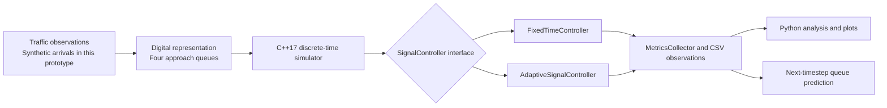
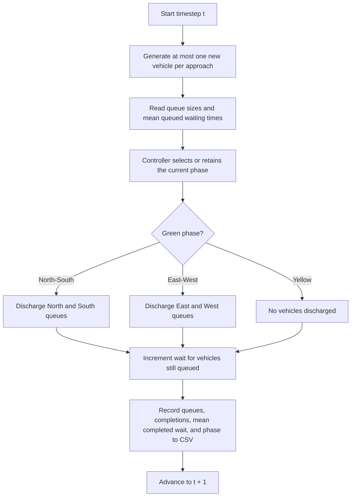
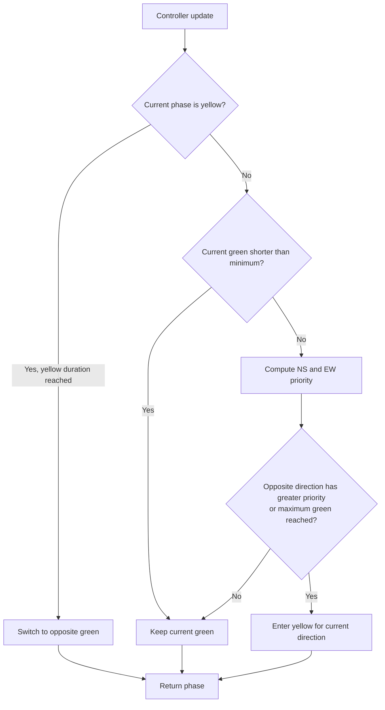
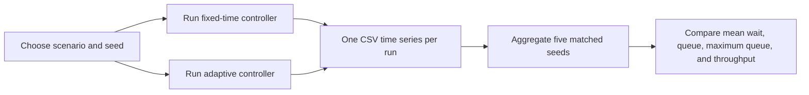
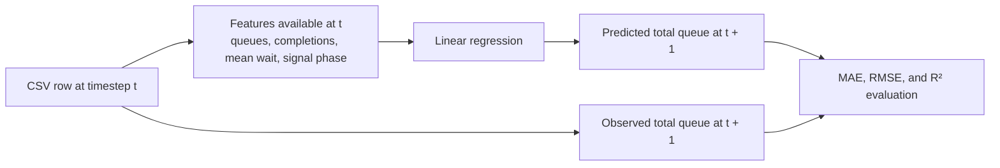

# TrafficFlow-DT

TrafficFlow-DT is a compact, simulation-oriented Digital Twin prototype for evaluating traffic-signal policies at a single urban intersection. It asks whether Queue-Aware Adaptive Signal Control can reduce waiting and queues versus a fixed-time baseline under changing synthetic demand. It is a research engineering prototype, not a production traffic-management system or a deployed Digital Twin.

## Overview and motivation

The project combines a deterministic C++17 discrete-time simulator with reproducible experiments and a small Python queue-prediction workflow. C++ is used for the simulation engine and explicit controller architecture; Python is used for experiment analysis, plotting, and tabular ML.

**Research question:** Can a queue-aware, rule-based controller reduce vehicle waiting time and queue length compared with fixed-time control under low, normal, peak, and asymmetric demand?

## Key contributions

- A one-second C++17 simulation of north, south, east, and west vehicle queues.
- A `SignalController` interface with fixed-time and interpretable queue-aware implementations.
- Seeded, matched controller experiments with CSV observations and metrics.
- Python analysis, plots, and a leakage-safe linear-regression prediction of next-timestep total queue.

## System architecture



The simulator is intentionally separated from controller policy: `TrafficSimulator` owns vehicle queues, arrivals, ordering of each timestep, and signal state; controllers decide phases; `MetricsCollector` records observations. See [architecture.md](docs/architecture.md) for component detail. This is a foundation for a mobility Digital Twin: synthetic observations could later be replaced or augmented with traffic sensors, GPS, signal state, and road-network data.

## Simulation model

Each step generates arrivals, updates the controller, discharges green approaches (one vehicle/lane/second), increments queued waiting times, and records state. Phases are north-south green/yellow and east-west green/yellow. A vehicle contains its ID, approach, arrival time, accumulated wait, completion time, and completion state.



The ordering above is the actual simulator sequence. Yellow phases do not discharge vehicles. A green approach can discharge up to `discharge_rate` vehicles per second; the supplied scenarios use the default value of one.

Demand uses independent Bernoulli arrivals from `std::mt19937`, seeded explicitly. The named scenarios are `low`, `normal`, `peak`, and `asymmetric` (higher north/south demand). Config JSON files document their rates; the minimal dependency-free C++ configuration maps these names directly in `Config.h`.

## Signal controllers

The fixed baseline has 30-second greens and 3-second yellows. Queue-Aware Adaptive Signal Control compares:

`priority = queue_weight × directional queue + waiting_weight × directional mean waiting`

It enforces a 10-second minimum green and 45-second maximum green. The maximum bound prevents a phase from holding green indefinitely. This is deliberately a transparent rule-based baseline, not reinforcement learning or a state-of-the-art control claim.



For north-south, the score uses `queue_weight × (north queue + south queue) + waiting_weight × (north mean wait + south mean wait)`; east-west is calculated analogously. The default weights are 1.0 and 0.025 respectively.

## Experimental methodology and results

All controller pairs use the same five seeds: 42, 123, 456, 789, and 1000. Each run is 3,600 simulated seconds. Values below are means across seeds; `±` is sample standard deviation for waiting time. The source data is in `results/summary.csv` and the per-second CSV files.



Using the same scenario and seed creates the same generated arrivals for both controllers, so controller choice is the intentional difference in each paired comparison.

| Scenario | Controller | Mean wait (s) | Mean queue | Mean throughput (veh/h) |
| --- | --- | ---: | ---: | ---: |
| Low | Fixed | 11.10 ± 0.33 | 3.56 | 1153.2 |
| Low | Adaptive | 5.47 ± 0.13 | 1.76 | 1153.0 |
| Normal | Fixed | 12.30 ± 0.12 | 8.82 | 2572.2 |
| Normal | Adaptive | 6.42 ± 0.15 | 4.61 | 2573.8 |
| Peak | Fixed | 16.61 ± 0.19 | 25.01 | 5395.2 |
| Peak | Adaptive | 24.29 ± 4.53 | 36.60 | 5382.8 |
| Asymmetric | Fixed | 14.92 ± 0.17 | 13.64 | 3289.0 |
| Asymmetric | Adaptive | 8.41 ± 0.11 | 7.69 | 3288.0 |

Adaptive control reduced mean wait by 50.7% (low), 47.8% (normal), and 43.6% (asymmetric), but increased it by 46.2% at peak demand. The latter is an important negative result: at saturated demand this greedy rule can switch too readily after minimum greens, while fixed long greens use available capacity more steadily. It motivates tuning or more advanced control rather than a blanket performance claim.

## Build and run

Requirements: CMake 3.14+, a C++17 compiler, and (for analysis) Python 3.10+.

```powershell
cd trafficflow-dt
cmake -S . -B build
cmake --build build
```

On a minimal Windows setup without CMake, this equivalent command works with MinGW:

```powershell
g++ -std=c++17 -Iinclude src/*.cpp -o build/traffic_sim.exe
```

Run one experiment:

```powershell
.\build\traffic_sim.exe --scenario normal --controller fixed --seed 42 --duration 3600 --output results\normal_fixed_42.csv
.\build\traffic_sim.exe --scenario normal --controller adaptive --seed 42 --duration 3600 --output results\normal_adaptive_42.csv
```

## Tests

```powershell
cmake --build build --target traffic_tests
ctest --test-dir build --output-on-failure
```

The lightweight test executable checks fixed phase sequencing, adaptive pressure selection, vehicle discharge/waiting behavior, metrics output, and deterministic simulation execution.

## Reproduce experiments and Python workflow

```powershell
py -m pip install -r requirements.txt
py scripts/run_experiments.py
py python/analyze_results.py
py python/plot_results.py
py python/train_model.py
```

`analyze_results.py` recomputes grouped statistics and percentage improvements from generated CSVs. `plot_results.py` saves queue-over-time, waiting comparison, throughput comparison, and cross-scenario figures to `results/figures/`. `train_model.py` predicts total queue at `t+1` using only fields observable at `t`; details are in [ml_methodology.md](docs/ml_methodology.md).



The target is explicitly shifted one timestep forward within each independent simulation run. No state from `t+1` is used as a model feature.

## Limitations and future work

Limitations: one intersection; simplified queues and phases; synthetic demand; no Bengaluru calibration, sensor feed, or real traffic data; a rule-based controller; small scale; and ML trained only on simulated observations.

Logical next steps include multi-intersection coordination, calibrated sensor/GPS data, OpenStreetMap/SUMO integration, public transport and multimodal modeling, uncertainty-aware forecasting, and only then reinforcement learning or graph-based models.

## Project structure

```text
trafficflow-dt/
  include/     C++ domain, controller, simulator, metric headers
  src/         implementation and command-line entry point
  tests/       assertion-based tests
  configs/     documented scenario rates
  scripts/     reproducible matched-seed experiment runner
  python/      analysis, plotting, and leakage-safe ML scripts
  results/     generated CSV observations and figures
  docs/        methodology, architecture, and ML notes
```
